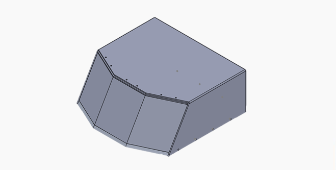
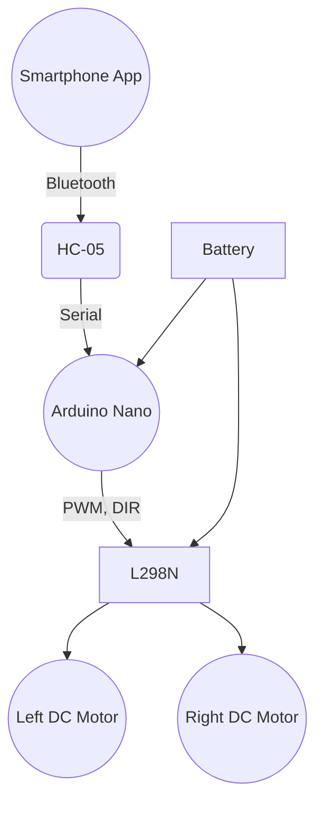
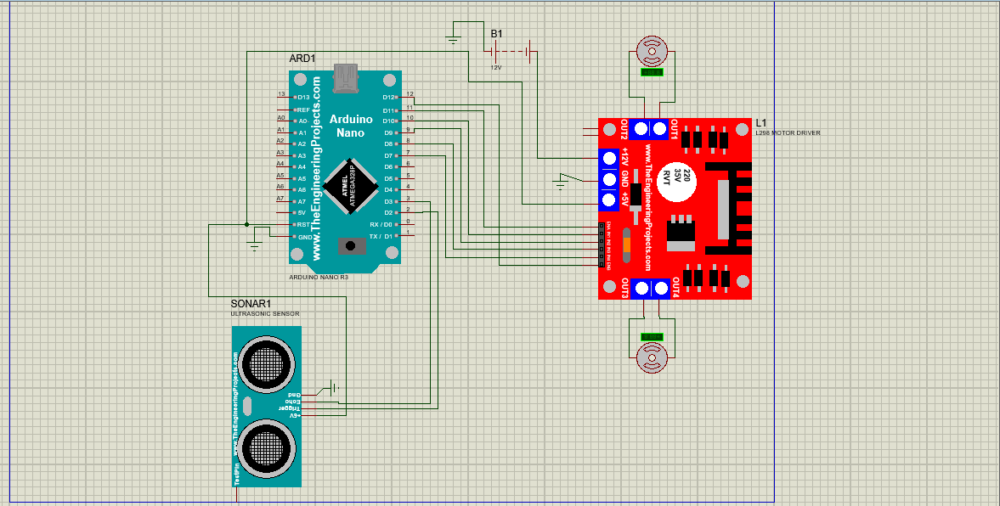
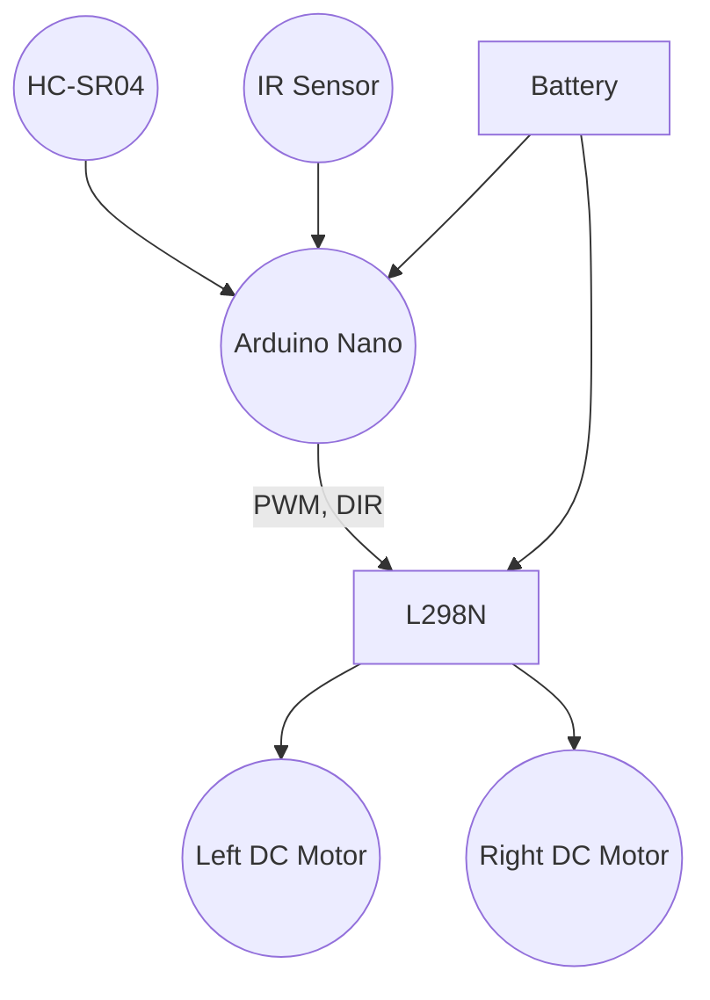

# 🤖 Bluetooth-Controlled Sumo Robot

This project allows you to manually control a sumo robot using a **Bluetooth module** and a **smartphone app**. The robot responds to directional commands like Forward, Backward, Left, Right, and Stop.
 
 

---

## 📸 Images

 

---

## 🧩 Components Used

| Component               | Description                                      |
|------------------------|--------------------------------------------------|
| Arduino Nano           | Microcontroller for executing logic              |
| HC-05 Bluetooth Module | Wireless communication with smartphone           |
| L298N Motor Driver     | Controls the direction and speed of two DC motors|
| 2 × DC Motors          | Provides motion to the robot                     |
| Battery Pack           | Powers the entire system                         |

---

## 🔧 Pin Configuration

| Component       | Arduino Pin | Description                          |
|----------------|-------------|--------------------------------------|
| Bluetooth RX   | D2          | SoftwareSerial RX                    |
| Bluetooth TX   | D3          | SoftwareSerial TX                    |
| Motor1 ENA     | D11         | Speed control (PWM) for left motor   |
| Motor1 IN1     | D10         | Direction input 1                    |
| Motor1 IN2     | D9          | Direction input 2                    |
| Motor2 IN3     | D8          | Direction input 3                    |
| Motor2 IN4     | D7          | Direction input 4                    |
| Motor2 ENB     | D12         | Speed control (PWM) for right motor  |

---

## 📟 Bluetooth Command List

| Command | Action        |
|--------|---------------|
| `F`    | Move Forward   |
| `B`    | Move Backward  |
| `L`    | Turn Left      |
| `R`    | Turn Right     |
| `S`    | Stop           |

---

## 🧠 Code Behavior

1. Initializes Bluetooth communication using `SoftwareSerial`.
2. Sets up all motor control pins as output.
3. Reads a character from Bluetooth.
4. Resets all motor pins to LOW to avoid conflicts.
5. Executes motor movement logic:
   - `F`: Left and right motors forward.
   - `B`: Both motors backward.
   - `L`: Spin left (left motor forward, right motor backward).
   - `R`: Spin right (left motor backward, right motor forward).
   - Any other input: Stop motors.

---

## 🔌 System Diagram (Mermaid)

---

## 📁 Project 2: Autonomous Sumo Robot (`sumo_robot_control_auto.ino`)

# 🧠 Autonomous Sumo Robot with Obstacle Avoidance

This project implements an **autonomous sumo robot** using an ultrasonic sensor to detect obstacles and an IR sensor to avoid falling off the ring edge.

---

## 📸 Images

  

---

## 🧩 Components Used

| Component               | Description                                      |
|------------------------|--------------------------------------------------|
| Arduino Nano           | Microcontroller for logic execution              |
| Ultrasonic Sensor      | Detects nearby opponents                         |
| IR Sensor              | Detects ring edge (white boundary)               |
| L298N Motor Driver     | Drives two DC motors                             |
| 2 × DC Motors          | Provides mobility                                |
| Battery Pack           | Powers the full system                           |

---

## 🔧 Pin Configuration

| Component         | Arduino Pin | Description                             |
|------------------|-------------|-----------------------------------------|
| Ultrasonic TRIG  | D2          | Sends trigger signal                    |
| Ultrasonic ECHO  | D3          | Receives echo to measure distance       |
| IR Sensor        | D6          | Detects white edge                      |
| Motor1 ENA       | D11         | Speed control (PWM) for left motor      |
| Motor1 IN1       | D10         | Direction input                         |
| Motor1 IN2       | D9          | Direction input                         |
| Motor2 IN3       | D8          | Direction input                         |
| Motor2 IN4       | D7          | Direction input                         |
| Motor2 ENB       | D12         | Speed control (PWM) for right motor     |

---

## 🧠 Code Behavior

1. Sends a 10μs pulse via TRIG.
2. Reads the pulse duration from ECHO and calculates distance.
3. Monitors IR sensor state.
4. Makes decisions:
   - **IR = HIGH (Edge Detected):** Reverse, then rotate away.
   - **Distance < 25 cm:** Move forward to engage.
   - **Else:** Spin in place to search for opponent.

---

## 🔌 System Diagram

